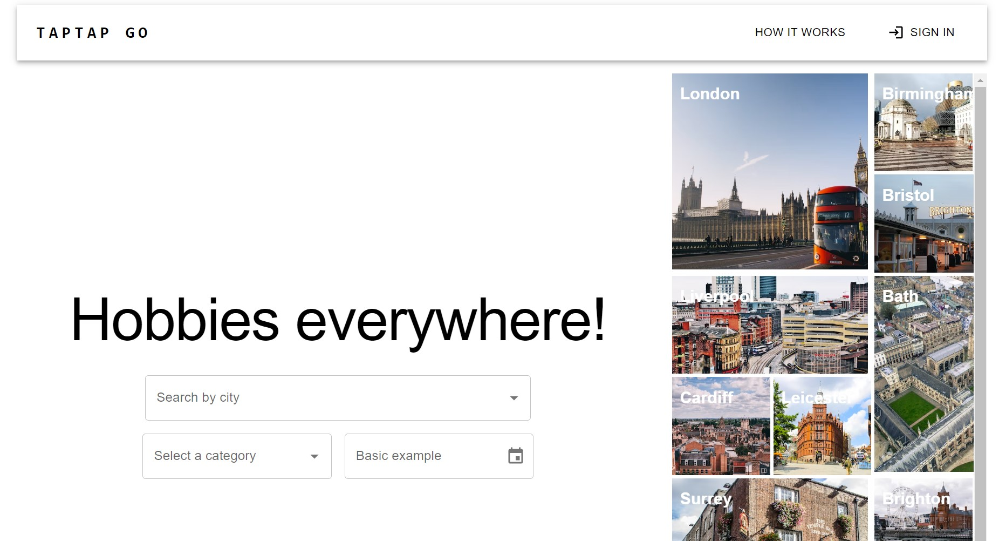

# TAP TAP GO  

Link to deployed app: https://hidden-citadel-37214.herokuapp.com/



  ## Table of Contents
  * [Description](#description)
  * [Installation](#installation)
  * [Usage](#usage)
  * [Technologies](#technologies)
  * [Contributing](#contributing)
  * [Tests](#tests)
  * [Questions](#questions)
  
  ## Description 
  A app that allows you to create an account to search dance classes, book them in advance and add them to your favourites.
  
  ## Installation
  ```
  Download all files from Github  
  Install dependencies using "npm run install" in both Client and Server folders
  ```

  ## Usage 
  ```
  Run "npm run start" in the Terminal for both Client and Server folders to start the server and display the UI
  ```
  
  ## Technologies
  The following technologies were used in this app:  
  - React  
  - MaterialUI  
  - MongoDB  
  - GraphQL  
  - Apollo Server  
  - Express  

  ## Tests
  ```
  N/A
  ```

  ## Questions
  If you have any questions, email me at beddow90@gmail.com  
  
  GitHub: https://github.com/RamiElsayed
  
